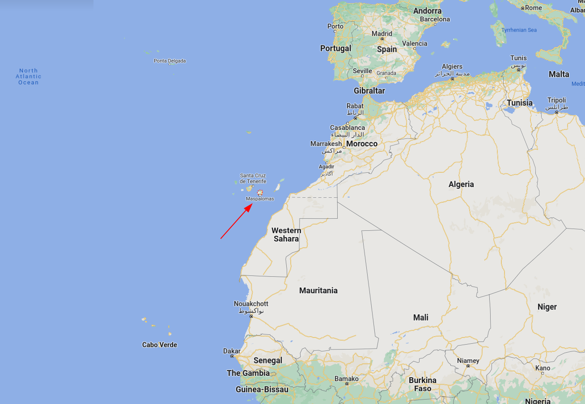

# 群岛

加那利群岛是位于大西洋的西班牙海外领地。它距离非洲大陆最近的地方摩洛哥只有100公里。作为西班牙最南端的自治区，加那利有 220 万人口，是欧盟人口最多的特区。七个主要岛屿是特内里费岛、富埃特文图拉岛、大加那利岛、兰萨罗特岛、拉帕尔马岛、戈梅拉岛和埃尔耶罗岛。 此外，群岛还包括许多较小的岛屿，如拉格拉西奥萨岛、阿莱格兰萨岛、罗伯士岛、蒙塔尼亚克拉拉、罗克德尔奥斯特和罗克德尔埃斯特。加那利群岛是西班牙最南端的地区，也是马卡罗尼西亚最大和人口最多的群岛。 由于地理位置的原因，加那利群岛历来被认为是连接非洲、北美洲、南美洲和欧洲四大洲的纽带。

  

# 山顶的杂货铺

